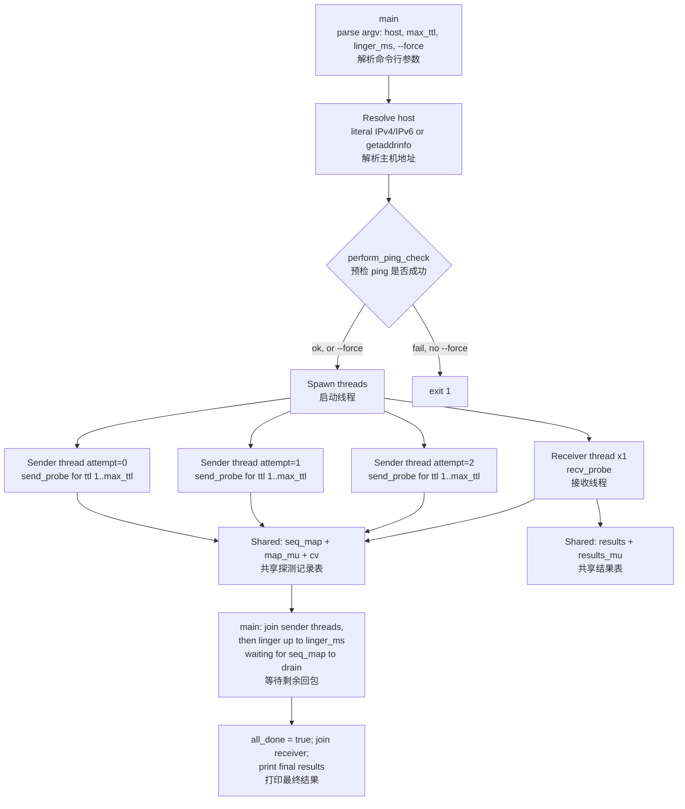

# traceroute

Multi-threaded ICMP traceroute over raw sockets, written in C++17. Supports both IPv4 and IPv6.

<p align="center">
  <a href="#english">English</a> | <a href="#中文">中文</a>
</p>

---

## English

### Overview

- Multi-threaded traceroute built on raw ICMP sockets (C++17, POSIX sockets).
- Supports both IPv4 (`ICMP`) and IPv6 (`ICMPv6`), including hostnames resolved via `getaddrinfo`.
- Fires **3 concurrent attempts per TTL** (configurable via `kProbesPerTtl` in the source) instead of probing sequentially, cutting wall-clock time for a full sweep.
- Reports RTT plus ICMP type/code for every attempt, and prints incremental partial results while waiting on stragglers.
- Pre-flight ping check with a `--force` override for networks that filter plain ICMP Echo but still allow TTL-triggered replies.

### Background

This project began as the implementation deliverable for [Lab 02 (ICMP and Traceroute)](https://netsos.csse.rose-hulman.edu/courses/netsec/docs/labs/lab02/), a network security course lab that asks students to reverse-engineer — from real packet captures — how ICMP Echo matching works and how `traceroute` discovers hops, then implement a working traceroute tool (C or Python suggested). The table below maps the lab's core questions to where this code answers them; the concurrency and IPv6 support described in Architecture go beyond what the lab asked for.

| Lab question | Where it's answered in this code |
|---|---|
| How does a host match an ICMP Echo Reply to the Echo Request that produced it, using ICMP headers alone? | `id` + `seq` fields of `IcmpEchoHeader` ([traceroute.cpp:51-58](traceroute.cpp#L51-L58)); `seq_map`, keyed by `seq` and validated against `ident` (`== getpid()`), in `recv_probe()` |
| How does traceroute determine each hop between source and destination? | TTL is set per probe via `set_ttl_or_hops()`; the router that lets the TTL expire replies with ICMP Time Exceeded, decoded in `recv_probe()`'s Time Exceeded branch — see the "Probe synchronization" diagram below for the full round trip |
| Implement a working traceroute tool (C or Python suggested) | This repository — written in C++17 instead, and extended past the lab's scope with IPv6/ICMPv6 support and concurrent multi-attempt probing (see Architecture) |

### Architecture

#### Threading model

`main()` resolves the target, runs a one-shot ping check, then spawns one receiver thread and `kProbesPerTtl` (3) sender threads — one per attempt index — that each sweep every TTL from 1 to `max_ttl` in parallel.



#### Probe synchronization — the `seq_map`

ICMP itself carries no notion of which hop or which attempt a reply belongs to — a Time Exceeded reply only echoes back the identifier/sequence number of the original Echo Request (inside the quoted original packet) plus the address of the router that dropped it. Because three sender threads fire probes across all TTLs concurrently, replies can arrive out of order and interleaved.

`seq_map` — an `unordered_map<uint16_t, Probe>` guarded by `map_mu` — is the side table that lets the single receiver thread recover which TTL and attempt a given sequence number belongs to, regardless of send/arrival order:

```mermaid
sequenceDiagram
    participant S as Sender thread 发送线程
    participant Map as seq_map (mutex) 探测记录表
    participant Net as Kernel / Network 内核与网络
    participant Rt as Router or destination 路由器或目标主机
    participant R as Receiver thread 接收线程
    participant Res as results (mutex) 结果表

    S->>Map: lock map_mu; seq_map[seq] = Probe(ttl, attempt, now)
    S->>Map: cv.notify_all()
    S->>Net: sendto ICMP Echo Request (TTL=ttl)
    Net->>Rt: IP packet, TTL decremented each hop
    Rt-->>Net: ICMP Time Exceeded, or Echo Reply if destination
    Net-->>R: recvfrom()
    R->>R: locate_icmp_offset(): parse IPv4/IPv6 + ICMP header
    R->>R: if Time Exceeded, unwrap quoted original packet to recover seq
    R->>Map: lock map_mu; find & erase seq_map[seq]
    Map-->>R: Probe(ttl, attempt, send_time)
    R->>R: rtt_ms = now - send_time
    R->>Res: lock results_mu; results[ttl-1][attempt] = Result(...)
    R->>Map: cv.notify_all()
```

`map_mu` + `cv` let the receiver thread block efficiently instead of busy-polling, while still waking promptly when a new probe is inserted or the program is shutting down (`all_done`). `results` uses a second, independent mutex, so the receiver thread's two critical sections — matching against `seq_map`, then recording into `results` — never need to hold both locks at once, keeping the locking simple enough to reason about and avoiding lock-ordering-related deadlocks.

#### Design notes

- Running 3 sender threads concurrently (one per attempt) instead of 3 sequential rounds cuts wall-clock time for a full sweep by roughly 3x, at the cost of bursting up to 3x the raw ICMP packets in flight at once — there's no rate limiting yet. The captured run below shows this concretely: all 3 threads race through every TTL up to `max_ttl` in a few milliseconds, so by the time the destination replies at TTL 10, probes for TTLs 11+ have already been sent and are left waiting out the linger window unanswered.
- Every probe opens, configures (TTL/hop limit), and closes its own raw socket (`send_probe`). This favors correctness/simplicity (each probe's TTL is fully isolated) over syscall efficiency — reusing one socket per sender thread would be a natural follow-up optimization.
- A best-effort ping check (`perform_ping_check`) runs first so the tool fails fast with a clear message if ICMP is filtered outright; `--force`/`-f` skips this gate for networks that block plain pings but still allow TTL-triggered Time Exceeded replies.

### Build & Run

```bash
# Requires a C++17 compiler and pthreads (macOS / Linux)
make                # or: g++ -std=c++17 -Wall -Wextra -pedantic -pthread -o traceroute traceroute.cpp

# Raw ICMP sockets require root privileges (or CAP_NET_RAW on Linux)
sudo ./traceroute www.example.com
sudo ./traceroute 8.8.8.8 20 3000
sudo ./traceroute 2606:4700:4700::1111 30 5000 --force

make clean          # remove the built binary
```

| Argument | Default | Meaning |
|---|---|---|
| `host` | — | IPv4/IPv6 literal or hostname |
| `max_ttl` | 30 | Maximum TTL / hop limit to probe (1–255) |
| `linger_ms` | 5000 | How long to keep waiting for outstanding replies after the last probe is sent (≥ 100 ms) |
| `--force` / `-f` | off | Skip the pre-flight ping check and probe anyway |

### Example Output

Real capture (`sudo ./traceroute google.com`) — trimmed to one partial update instead of all nine near-identical ones (the 500 ms report cycle repeats the same snapshot while waiting):

```
Input is a hostname: google.com
Resolved hostname to an IPv4 address: 142.251.210.238
Ping check succeeded. Starting traceroute...
Waiting up to 5000 ms for outstanding replies...

Traceroute results (partial update: 1):
 1  |100.71.12.1             7.45 ms  (type=11 code= 0)  |100.71.12.1             7.17 ms  (type=11 code= 0)  |100.71.12.1             7.53 ms  (type=11 code= 0)  
 2  |66.253.181.129          7.32 ms  (type=11 code= 0)  |66.253.181.129          7.23 ms  (type=11 code= 0)  |66.253.181.129          7.50 ms  (type=11 code= 0)  
 3  |*                                                   |*                                                   |*                                                   
 4  |*                                                   |*                                                   |*                                                   
 5  |173.230.125.30         12.81 ms  (type=11 code= 0)  |173.230.125.30         15.10 ms  (type=11 code= 0)  |173.230.125.30         15.16 ms  (type=11 code= 0)  
 6  |173.230.125.23         11.65 ms  (type=11 code= 0)  |173.230.125.23         11.80 ms  (type=11 code= 0)  |173.230.125.23         11.73 ms  (type=11 code= 0)  
 7  |74.125.119.216         11.93 ms  (type=11 code= 0)  |74.125.119.216         11.96 ms  (type=11 code= 0)  |74.125.119.216         12.01 ms  (type=11 code= 0)  
 8  |74.125.251.183         11.29 ms  (type=11 code= 0)  |74.125.251.183         11.58 ms  (type=11 code= 0)  |74.125.251.183         11.34 ms  (type=11 code= 0)  
 9  |142.251.60.207         14.78 ms  (type=11 code= 0)  |142.251.60.207         14.82 ms  (type=11 code= 0)  |142.251.60.207         14.88 ms  (type=11 code= 0)  
10  |142.251.210.238        10.93 ms  (type= 0 code= 0)  |142.251.210.238        10.88 ms  (type= 0 code= 0)  |142.251.210.238        10.95 ms  (type= 0 code= 0)  
11 probes remaining unanswered.
--------------------------------------------------------------------

  ... (8 more identical partial updates every ~500 ms — hops 1–10 are already resolved; the 11 outstanding
       probes are TTLs beyond the destination that were sent before `got_destination_reached` took effect,
       see Design notes above) ...

Wait deadline reached with 11 pending probes still unanswered.

Traceroute results:
 1  |100.71.12.1             7.45 ms  (type=11 code= 0)  |100.71.12.1             7.17 ms  (type=11 code= 0)  |100.71.12.1             7.53 ms  (type=11 code= 0)  
 2  |66.253.181.129          7.32 ms  (type=11 code= 0)  |66.253.181.129          7.23 ms  (type=11 code= 0)  |66.253.181.129          7.50 ms  (type=11 code= 0)  
 3  |*                                                   |*                                                   |*                                                   
 4  |*                                                   |*                                                   |*                                                   
 5  |173.230.125.30         12.81 ms  (type=11 code= 0)  |173.230.125.30         15.10 ms  (type=11 code= 0)  |173.230.125.30         15.16 ms  (type=11 code= 0)  
 6  |173.230.125.23         11.65 ms  (type=11 code= 0)  |173.230.125.23         11.80 ms  (type=11 code= 0)  |173.230.125.23         11.73 ms  (type=11 code= 0)  
 7  |74.125.119.216         11.93 ms  (type=11 code= 0)  |74.125.119.216         11.96 ms  (type=11 code= 0)  |74.125.119.216         12.01 ms  (type=11 code= 0)  
 8  |74.125.251.183         11.29 ms  (type=11 code= 0)  |74.125.251.183         11.58 ms  (type=11 code= 0)  |74.125.251.183         11.34 ms  (type=11 code= 0)  
 9  |142.251.60.207         14.78 ms  (type=11 code= 0)  |142.251.60.207         14.82 ms  (type=11 code= 0)  |142.251.60.207         14.88 ms  (type=11 code= 0)  
10  |142.251.210.238        10.93 ms  (type= 0 code= 0)  |142.251.210.238        10.88 ms  (type= 0 code= 0)  |142.251.210.238        10.95 ms  (type= 0 code= 0)  
11 probes remaining unanswered.
Destination reached at TTL 10
--------------------------------------------------------------------
```

---

## 中文

### 简介

- 基于原始 ICMP 套接字实现的多线程 traceroute,使用 C++17 和 POSIX 套接字编写。
- 同时支持 IPv4(`ICMP`)和 IPv6(`ICMPv6`),也支持直接传入域名(内部通过 `getaddrinfo` 解析)。
- 每个 TTL 会**并发发起 3 次探测尝试**(可通过源码中的 `kProbesPerTtl` 调整),而非顺序逐个探测,从而缩短一次完整扫描所需的时间。
- 每次尝试都会记录 RTT 以及 ICMP type/code,并在等待剩余回包期间持续打印阶段性结果。
- 内置 ping 预检机制,`--force` 可用于跳过预检,应对屏蔽了普通 ICMP Echo、但仍允许因 TTL 耗尽而返回响应的网络环境。

### 项目背景

这个项目最初是网络安全课程 [Lab 02(ICMP 与 Traceroute)](https://netsos.csse.rose-hulman.edu/courses/netsec/docs/labs/lab02/) 的实现作业,该实验要求学生先通过真实抓包逆向分析 ICMP Echo 的匹配机制、以及 traceroute 发现路径的原理,再实现一个能完成同样功能的 traceroute 工具(建议用 C 或 Python)。下表把实验里的核心问题对应到了代码里具体的回答位置;架构设计里讲到的并发和 IPv6 支持,则已经超出了实验本身的要求。

| 实验问题 | 在代码里的对应位置 |
|---|---|
| 主机如何仅凭 ICMP 头部信息,把一个 Echo Reply 匹配回对应的 Echo Request? | `IcmpEchoHeader` 的 `id` + `seq` 字段([traceroute.cpp:51-58](traceroute.cpp#L51-L58));`recv_probe()` 里以 `seq` 为 key、并用 `ident`(即 `getpid()`)校验的 `seq_map` |
| traceroute 是如何确定源和目的地之间每一跳的? | 每次探测通过 `set_ttl_or_hops()` 设置 TTL;当某一跳的路由器让 TTL 耗尽时会回一个 ICMP Time Exceeded,这部分在 `recv_probe()` 的 Time Exceeded 分支里解析——完整的往返流程见下面"探测同步机制"里的时序图 |
| 实现一个能工作的 traceroute 工具(建议用 C 或 Python) | 也就是这个仓库本身——只不过用 C++17 写的,并且在实验要求之外还扩展了 IPv6/ICMPv6 支持和并发多次探测(见"架构设计") |

### 架构设计

#### 线程模型

`main()` 先解析目标地址,做一次性的 ping 预检,然后启动 1 个接收线程和 `kProbesPerTtl`(3 个)发送线程——每个发送线程对应一次尝试编号——各自并行地从 TTL=1 扫描到 `max_ttl`。


#### 探测同步机制 —— `seq_map`

ICMP 协议本身并不知道一个回包属于哪一跳、哪一次尝试——Time Exceeded 回包只会在"引用的原始数据包"里带回原始 Echo Request 的 identifier/sequence,以及丢弃这个包的路由器地址。由于 3 个发送线程会对所有 TTL 并发发起探测,回包到达的顺序可能是乱序、交错的。

`seq_map` ——一个由 `map_mu` 保护的 `unordered_map<uint16_t, Probe>` —— 就是让唯一的接收线程能够根据 sequence 反查出对应 TTL 和尝试编号的旁路表,不依赖发送或到达的顺序:

```mermaid
sequenceDiagram
    participant S as Sender thread 发送线程
    participant Map as seq_map (mutex) 探测记录表
    participant Net as Kernel / Network 内核与网络
    participant Rt as Router or destination 路由器或目标主机
    participant R as Receiver thread 接收线程
    participant Res as results (mutex) 结果表

    S->>Map: lock map_mu; seq_map[seq] = Probe(ttl, attempt, now)
    S->>Map: cv.notify_all()
    S->>Net: sendto ICMP Echo Request (TTL=ttl)
    Net->>Rt: IP packet, TTL decremented each hop
    Rt-->>Net: ICMP Time Exceeded, or Echo Reply if destination
    Net-->>R: recvfrom()
    R->>R: locate_icmp_offset(): parse IPv4/IPv6 + ICMP header
    R->>R: if Time Exceeded, unwrap quoted original packet to recover seq
    R->>Map: lock map_mu; find & erase seq_map[seq]
    Map-->>R: Probe(ttl, attempt, send_time)
    R->>R: rtt_ms = now - send_time
    R->>Res: lock results_mu; results[ttl-1][attempt] = Result(...)
    R->>Map: cv.notify_all()
```

`map_mu` + 条件变量 `cv` 让接收线程可以高效地阻塞等待(而不是忙轮询),同时在有新探测发出、或程序准备退出(`all_done`)时能被及时唤醒。`results` 使用另一把独立的锁,这样接收线程的两个临界区——先在 `seq_map` 中查找匹配,再写入 `results`——永远不需要同时持有两把锁,让加锁逻辑保持简单、也避免了因加锁顺序不一致而产生死锁的风险。

#### 设计取舍

- 让 3 个发送线程(每次尝试一个)并发运行,而不是顺序跑 3 轮,能把一次完整扫描的墙钟时间缩短到大约 1/3,代价是同一时刻网络中最多会有 3 倍的原始 ICMP 包在飞行——目前还没有限速机制。下面的真实抓取例子就直观展示了这一点:3 个线程会在几毫秒内把 `max_ttl` 以内所有 TTL 都发送完毕,所以当目标在 TTL 10 处回复时,TTL 11 及以后的探测其实早已发出,只能在剩余的等待窗口里一直挂着得不到回应。
- 每一次探测都会单独打开、配置(设置 TTL/跳数限制)、再关闭一个原始套接字(`send_probe`)。这个设计优先保证正确性和简单性(每次探测的 TTL 完全互不干扰),而非系统调用效率——让每个发送线程复用同一个 socket 会是一个很自然的后续优化方向。
- 程序会先做一次尽力而为的 ping 预检(`perform_ping_check`),如果 ICMP 被完全过滤,可以快速失败并给出明确提示;`--force`/`-f` 可以跳过这个检查,适用于屏蔽了普通 ping、但仍允许因 TTL 耗尽而返回响应的网络环境。

### 编译与运行

```bash
# 需要支持 C++17 的编译器以及 pthread(macOS / Linux)
make                # 或者: g++ -std=c++17 -Wall -Wextra -pedantic -pthread -o traceroute traceroute.cpp

# 原始 ICMP 套接字需要 root 权限(Linux 上也可用 CAP_NET_RAW 代替)
sudo ./traceroute www.example.com
sudo ./traceroute 8.8.8.8 20 3000
sudo ./traceroute 2606:4700:4700::1111 30 5000 --force

make clean          # 删除编译产物
```

| 参数 | 默认值 | 含义 |
|---|---|---|
| `host` | — | IPv4/IPv6 地址或域名 |
| `max_ttl` | 30 | 探测的最大 TTL / 跳数上限(1–255) |
| `linger_ms` | 5000 | 最后一个探测发出后,继续等待剩余回包的时长(≥ 100 ms) |
| `--force` / `-f` | 关闭 | 跳过预检 ping,直接开始探测 |

### 示例输出

真实抓取记录(`sudo ./traceroute google.com`)——只保留了 1 次阶段性输出,而不是全部 9 次几乎一样的重复内容(等待期间每 500ms 会重复打印同一份快照):

```
Input is a hostname: google.com
Resolved hostname to an IPv4 address: 142.251.210.238
Ping check succeeded. Starting traceroute...
Waiting up to 5000 ms for outstanding replies...

Traceroute results (partial update: 1):
 1  |100.71.12.1             7.45 ms  (type=11 code= 0)  |100.71.12.1             7.17 ms  (type=11 code= 0)  |100.71.12.1             7.53 ms  (type=11 code= 0)  
 2  |66.253.181.129          7.32 ms  (type=11 code= 0)  |66.253.181.129          7.23 ms  (type=11 code= 0)  |66.253.181.129          7.50 ms  (type=11 code= 0)  
 3  |*                                                   |*                                                   |*                                                   
 4  |*                                                   |*                                                   |*                                                   
 5  |173.230.125.30         12.81 ms  (type=11 code= 0)  |173.230.125.30         15.10 ms  (type=11 code= 0)  |173.230.125.30         15.16 ms  (type=11 code= 0)  
 6  |173.230.125.23         11.65 ms  (type=11 code= 0)  |173.230.125.23         11.80 ms  (type=11 code= 0)  |173.230.125.23         11.73 ms  (type=11 code= 0)  
 7  |74.125.119.216         11.93 ms  (type=11 code= 0)  |74.125.119.216         11.96 ms  (type=11 code= 0)  |74.125.119.216         12.01 ms  (type=11 code= 0)  
 8  |74.125.251.183         11.29 ms  (type=11 code= 0)  |74.125.251.183         11.58 ms  (type=11 code= 0)  |74.125.251.183         11.34 ms  (type=11 code= 0)  
 9  |142.251.60.207         14.78 ms  (type=11 code= 0)  |142.251.60.207         14.82 ms  (type=11 code= 0)  |142.251.60.207         14.88 ms  (type=11 code= 0)  
10  |142.251.210.238        10.93 ms  (type= 0 code= 0)  |142.251.210.238        10.88 ms  (type= 0 code= 0)  |142.251.210.238        10.95 ms  (type= 0 code= 0)  
11 probes remaining unanswered.
--------------------------------------------------------------------

  ...(后面还有 8 次一模一样的阶段性输出,每 ~500ms 一次——第 1–10 跳此时已经全部解析完成;剩下的
      11 个探测是目标之后的 TTL,它们在 `got_destination_reached` 生效之前就已经发出了,详见上面的
      "设计取舍") ...

Wait deadline reached with 11 pending probes still unanswered.

Traceroute results:
 1  |100.71.12.1             7.45 ms  (type=11 code= 0)  |100.71.12.1             7.17 ms  (type=11 code= 0)  |100.71.12.1             7.53 ms  (type=11 code= 0)  
 2  |66.253.181.129          7.32 ms  (type=11 code= 0)  |66.253.181.129          7.23 ms  (type=11 code= 0)  |66.253.181.129          7.50 ms  (type=11 code= 0)  
 3  |*                                                   |*                                                   |*                                                   
 4  |*                                                   |*                                                   |*                                                   
 5  |173.230.125.30         12.81 ms  (type=11 code= 0)  |173.230.125.30         15.10 ms  (type=11 code= 0)  |173.230.125.30         15.16 ms  (type=11 code= 0)  
 6  |173.230.125.23         11.65 ms  (type=11 code= 0)  |173.230.125.23         11.80 ms  (type=11 code= 0)  |173.230.125.23         11.73 ms  (type=11 code= 0)  
 7  |74.125.119.216         11.93 ms  (type=11 code= 0)  |74.125.119.216         11.96 ms  (type=11 code= 0)  |74.125.119.216         12.01 ms  (type=11 code= 0)  
 8  |74.125.251.183         11.29 ms  (type=11 code= 0)  |74.125.251.183         11.58 ms  (type=11 code= 0)  |74.125.251.183         11.34 ms  (type=11 code= 0)  
 9  |142.251.60.207         14.78 ms  (type=11 code= 0)  |142.251.60.207         14.82 ms  (type=11 code= 0)  |142.251.60.207         14.88 ms  (type=11 code= 0)  
10  |142.251.210.238        10.93 ms  (type= 0 code= 0)  |142.251.210.238        10.88 ms  (type= 0 code= 0)  |142.251.210.238        10.95 ms  (type= 0 code= 0)  
11 probes remaining unanswered.
Destination reached at TTL 10
--------------------------------------------------------------------
```
